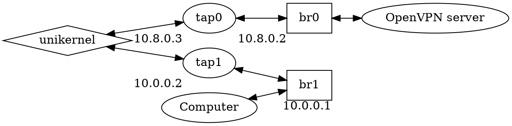

We are going to use `mirage-router` as a unikernel. Unikernel can be used to
highlight a possible network configuration for your computer. This configuration
consists of having 2 interfaces:
1) one to retrieve all the packets you want to send to Internet
2) one to send all encrypted packets to your VPN server only



The unikernel will then encrypt all the packets received and send them back to
the VPN server. The server can then decrypt them and send them to Internet.
The reverse will also be true.

One disadvantage of this method is the assignment of IP addresses. They can only
be fixed between the client and the server.

# Network configuration

As with the virtualisation of any system, a network configuration stage is
necessary so that the virtualised systems can communicate. The general idea is
to create a 'bridge' to which we can attach the virtual interfaces used by our
systems. In our configuration, 2 bridges are required. However, we need to use
the same IP address as the one our VPN server will allocate to us. In our
previous configuration, we assigned `alice` the IP 10.8.0.2.

## Create our bridges

Let's start by creating our bridge:
```sh
$ sudo ip link add name br0 type bridge
$ sudo ip link set dev br0 up
$ sudo ip address add 10.8.0.2/24 dev br0
$ sudo ip link add name br1 type bridge
$ sudo ip link set dev br1 up
$ sudo ip address add 10.0.0.1/24 dev br1
```

## Create TAP interfaces

A solo5 unikernel needs a _tap_ interface. This is a virtual interface on which
our unikernel will define its IP address and connect to the network. Here's how
to create a _tap_ interface.

```sh
$ sudo ip tuntap add mode tap tap0
$ sudo ip link set dev tap0 up
$ sudo ip link set tap0 master br0
$ sudo ip tuntap add mode tap tap1
$ sudo ip link set dev tap1 up
$ sudo ip link set tap1 master br1
```

A _tap_ interface (unlike _tun_) requires the Ethernet frame. Some will note
that we have configured our OpenVPN server with _tun_ (`dev tun`). However, our
unikernel does not transmit packets to the OpenVPN server without the Ethernet
frame - so our unikernel is compatible with a server using a _tun_ interface.

This choice is based on our observation that there are few OpenVPN server
configurations with _tap_ interfaces.

## Firewall

As with the server, we need to enable our virtual machines to communicate with
the outside world:

```sh
$ sudo sysctl net.ipv4.ip_forward=1
$ sudo iptables -t nat -A POSTROUTING -s 10.0.0.0/24 -j MASQUERADE
```

The aim of our last command is to let our unikernel communicate with the outside
world even if it is using a private IP address (in our case 10.0.0.2). Note that
this type of configuration becomes incompatible with OpenVPN as a client.

## Persistence

This configuration is not persistent, meaning that the next time you reboot your
computer, `br{0,1}` and `tap{0,1}` will disappear. However, your system can
manage the creation of these elements at boot time. In Debian, for example, you
can modify the `/etc/network/interfaces` file to create your bridges at boot
time:

```sh
$ cat >>/etc/network/interfaces <<EOF
auto br0
iface br0 inet static
  address 10.8.0.2
  netmask 255.255.255.0
  broadcast 10.8.0.255
  bridge_ports none
  bridge_stp off
  bridge_fd 0
  bridge_maxwait 0

auto br1
iface br1 inet static
  address 10.0.0.1
  netmask 255.255.255.0
  broadcast 10.0.0.255
  bridge_ports none
  bridge_stp off
  bridge_fd 0
  bridge_maxwait 0
EOF
```

Other distributions (like Archlinux) use `netctl`, for example. Simply create a
new profile such as:

```sh
$ cat >/etc/netctl/openvpn-bridge<<EOF
Description="OpenVPN Bridge"
Interface=br0
Connection=bridge
IP=static
Address='10.8.0.2/24'
SkipForwardingDelay=yes
EOF
$ cat >/etc/netctl/kvm-bridge<<EOF
Description="KVM Bridge"
Interface=br1
Connection=bridge
IP=static
Address='10.0.0.1/24'
SkipForwardingDelay=yes
EOF
```

And enable it:

```sh
$ sudo netctl enable openvpn-bridge
$ sudo netctl enable kvm-bridge
```

As far as _tap_ interfaces are concerned, their management is often relegated to
virtual machine managers such as `libvirt`, [Xen][xen] or
[albatross][albatross]. On this last point, we are going to present these
different solutions later, particularly QubesOS, which uses Xen.

# MirageVPN configuration

We can now start configuring our client. The materials required for our client
are:
1) our client's certificate `alice.crt`
2) her private key `alice.key`
3) the `ta.key` file we generated on our server

Our unikernel has no file system. The idea is to create an image of our
configuration which can then be used by our unikernel. Fortunately, OpenVPN
allows you to put the content of our materials directly into the configuration
file:

```sh
$ cat >config.sh<<STOP
#!/bin/bash

CA_FILE=$1
CRT_FILE=$2
KEY_FILE=$3
TA_FILE=$4
OUTPUT_FILE=$5

cat >$OUTPUT_FILE<<EOF
client
proto tcp
remote <ipv4> 1194
nobind
persist-key
cipher AES-256-CBC
remote-cert-tls server
EOF

echo "<ca>" >> $OUTPUT_FILE
cat $CA_FILE | \
  sed -ne '/-BEGIN CERTIFICATE-/,/-END CERTIFICATE-/p' >> $OUTPUT_FILE
echo "</ca>" >> $OUTPUT_FILE

echo "<cert>" >> $OUTPUT_FILE
cat $CRT_FILE | \
  sed -ne '/-BEGIN CERTIFICATE-/,/-END CERTIFICATE-/p' >> $OUTPUT_FILE
echo "</cert>" >> $OUTPUT_FILE

echo "<key>" >> $OUTPUT_FILE
cat $KEY_FILE | \
  sed -ne '/-BEGIN PRIVATE KEY-/,/-END PRIVATE KEY-/p' >> $OUTPUT_FILE
echo "</key>" >> $OUTPUT_FILE

echo "tls-auth [inline] 1" >> $OUTPUT_FILE
echo "<tls-auth>" >> $OUTPUT_FILE
cat $TA_FILE | \
  sed -ne '/-BEGIN OpenVPN Static key V1-/,/-END OpenVPN Static key V1-/p' >> $OUTPUT_FILE
echo "</tls-auth>" >> $OUTPUT_FILE

SIZE=$(stat --printf="%s" $OUTPUT_FILE)
truncate -s $(( ( ( $SIZE + 512 - 1 ) / 512 ) * 512 )) $OUTPUT_FILE
STOP
```

In this little script, you need to replace <ipv4> with the public IP address of
your OpenVPN server. This little script will generate a compatible configuration
file for our unikernel. Just run it this way:

```sh
$ scp root@<ipv4>:/root/easy-rsa/pki/ca.crt .
$ scp root@<ipv4>:/root/easy-rsa/pki/issued/alice.crt .
$ scp root@<ipv4>:/root/easy-rsa/pki/private/alice.key .
$ scp root@<ipv4>:/etc/openvpn/server/ta.key .
$ chmod +x config.sh
$ ./config.sh ca.crt alice.crt alice.key ta.key alice.config
```

# How to launch your MirageVPN client

```sh
$ solo5-hvt --block:storage=alice.config \
  --net:service=tap1 --net:private=tap0 -- ovpn-router.hvt \
  --private-ipv4=10.8.0.3/24 --private-ipv4-gateway=10.8.0.2 \
  --ipv4=10.0.0.2/24 --ipv4-gateway=10.0.0.1
```

[albatross]: https://github.com/robur-coop/albatross
[xen]: https://xenproject.org/
